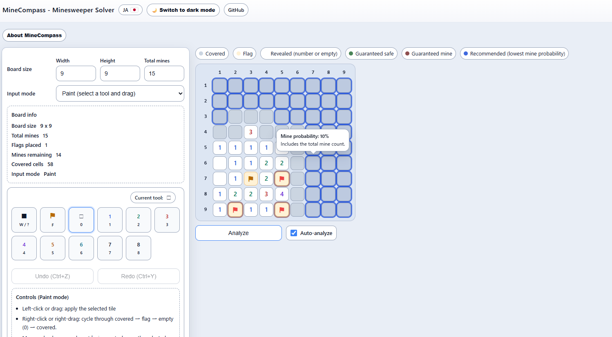

# MineCompass

MineCompass is a browser-based **Minesweeper solver** that lets you enter a board position and inspect:

- **guaranteed safe cells**
- **guaranteed mines**
- **recommended cells** with the **lowest mine probability**
- **input contradictions** in the current board state

It is designed as a lightweight static web app.

## Live Demo

- English: <https://yukio0.github.io/mine-compass/>
- Japanese: <https://yukio0.github.io/mine-compass/ja/>

 <!-- markdownlint-disable-line MD033 -->

## How It Works

MineCompass analyzes the board state you enter and derives constraints from the revealed numbers.

Depending on the size of the unresolved frontier, it will either:

- compute **exact probabilities**, or
- fall back to an **approximate estimate** for larger positions

This keeps the tool responsive while still providing strong practical guidance.

## How to Use

1. Set the **board width**, **height**, and **total mines**.
2. Enter the current board state using either **Paint** or **Cycle** mode.
3. Click **Analyze** or enable **Auto-analyze**.
4. Read the result highlights:
   - **Guaranteed safe**: safe to open
   - **Guaranteed mine**: must be a mine
   - **Recommended**: lowest-probability candidate when no forced move exists
5. Hover over a covered cell on desktop, or long-press on touch devices, to view its mine probability.

## Controls

### Paint Mode

- Left click / drag: apply the selected tile
- Right click / right drag: cycle through covered → flag → empty (0) → covered
- Mouse wheel or arrow keys: change the selected tool
- Keyboard:
  - `0`-`8` for numbers
  - `F` for a flag
  - `W` or `?` for covered

### Cycle Mode

- Left click: cycle forward through states
- Right click: cycle backward through states
- Keyboard:
  - `0`-`8` for numbers
  - `F` for a flag
  - `W` or `?` for covered

## Contradiction Detection

If the entered board state is inconsistent, MineCompass highlights the problem and explains the contradiction.

Examples include:

- too many flagged or confirmed mines around a number
- too few remaining covered cells to satisfy a number
- a total mine count that is impossible for the current board
